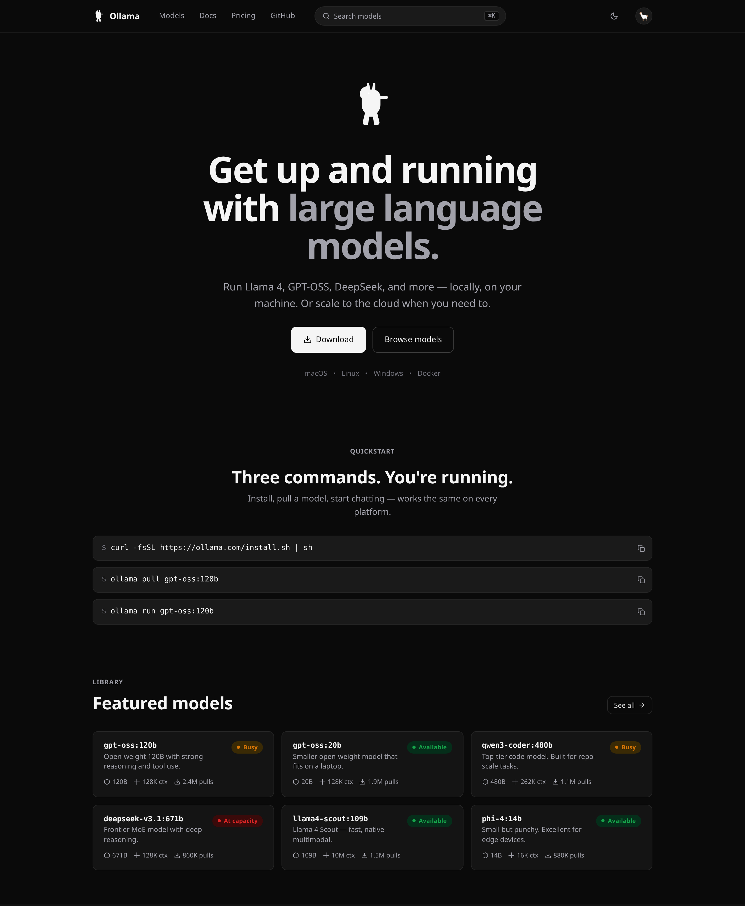
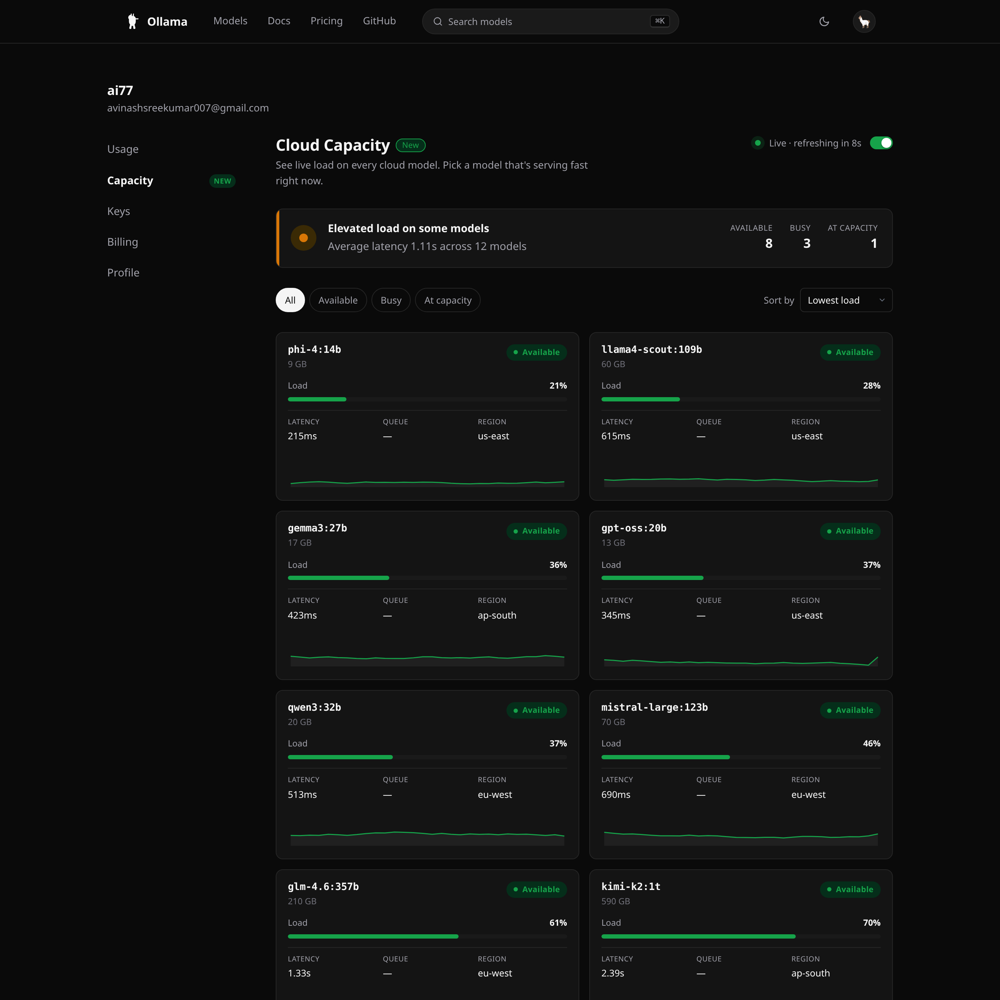
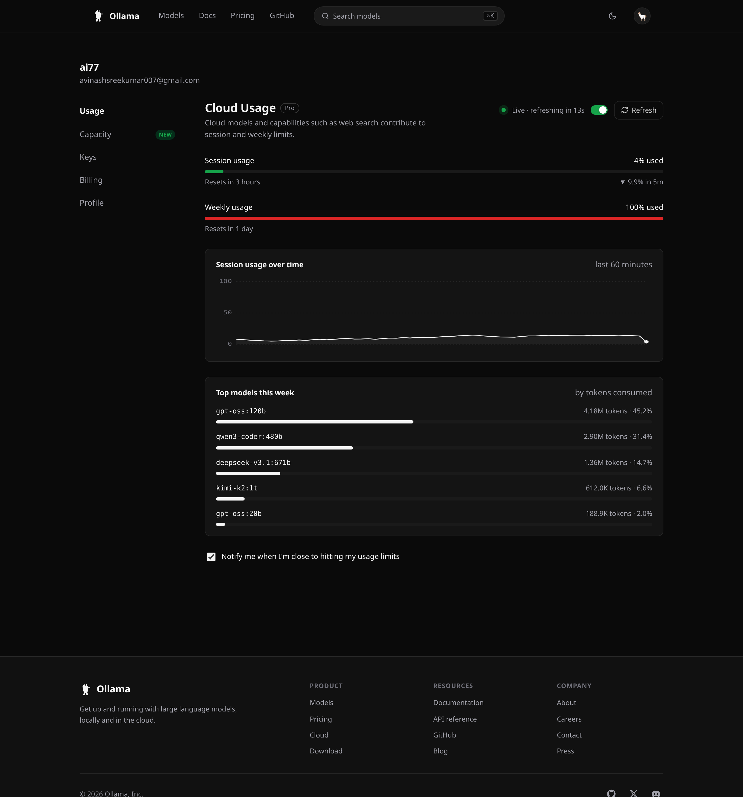
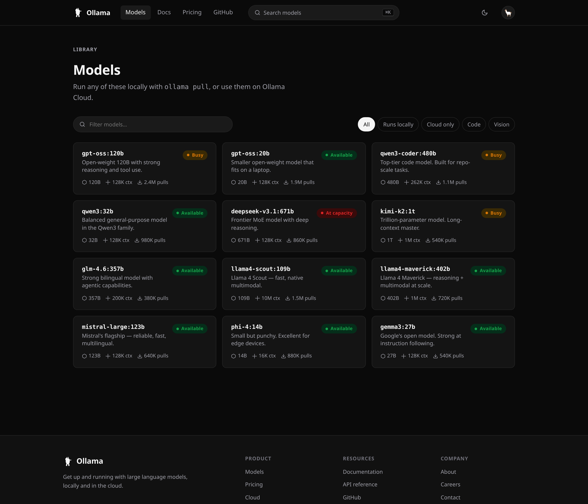
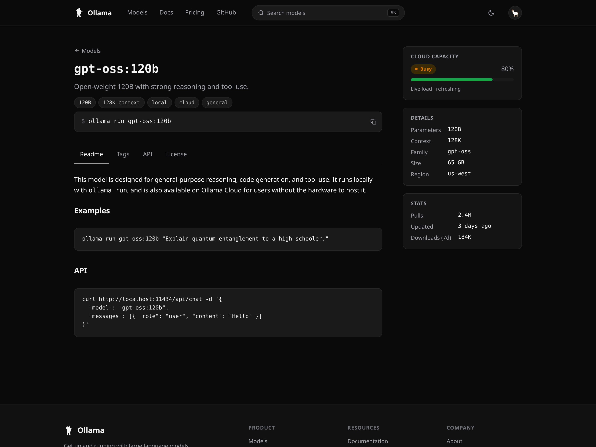
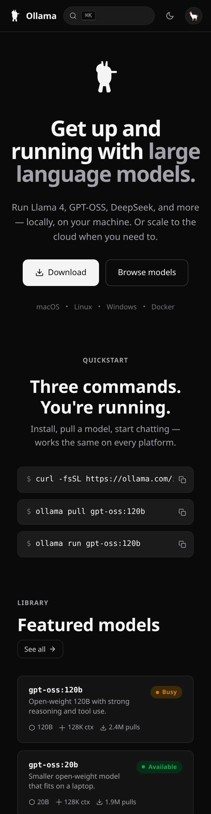
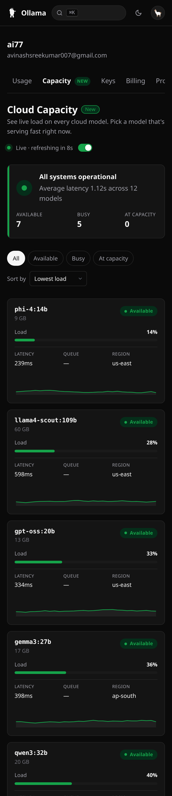

# Ollama — full site rebuild

A complete redesign of ollama.com plus two real product features that don't
exist today. Built as a portfolio piece for an Ollama application.

> **Live:** https://avisre.github.io/ollama-redesign/



---

## The two new features

### Cloud Capacity dashboard

Ollama doesn't have anything like this today. When you're picking a cloud model
and one is slow, there's no way to know if another is faster. This page shows
live load, latency, and queue depth for every cloud model — filter by status,
sort by latency, pick the one that's serving fast right now.



### Live Usage page

The current ollama.com/settings is a snapshot — refresh the tab to see new
state. This version auto-refreshes every 15s with a visible countdown, pauses
when the tab is hidden, and shows a 60-min sparkline + trend delta + per-model
token breakdown.



---

## The site

| Page | What's here |
|------|-------------|
| `index.html`     | Hero, install command, featured models, why-Ollama, CTA |
| `library.html`   | Browse all models — search + filter (Local / Cloud / Code / Vision) |
| `model.html`     | Per-model detail — readme, tags, API examples, **live capacity widget in the sidebar** |
| `settings.html`  | Account — Usage + Capacity dashboards (above) |
| `pricing.html`   | Local / Pro / Team |
| `docs.html`      | Quickstart |
| `404.html`       | Wandering llama |

### Library page



### Model detail page

The capacity widget in the sidebar updates live so you can see how busy a
model is before you pull it.



### Mobile

Real responsive design, not just media queries. Topbar collapses, settings
sidebar becomes a horizontal scroller, model grid reflows, status banner
stacks vertically.

<table>
<tr>
<td></td>
<td></td>
</tr>
</table>

---

## Site-wide craft

What a frontend-designer founder will notice first:

- **Native Ollama llama mark** as an inline SVG symbol — used in topbar,
  hero (with a soft float animation), footer, and 404. Single source of
  truth in `logo.svg`, referenced via `<use href="logo.svg#root"/>`.
- **Real design system** in `styles.css` — color tokens, spacing scale,
  motion curves, typography ramp. One change to `--text` rebrands the
  whole site. Apple-style `--ease: cubic-bezier(0.2, 0.8, 0.2, 1)`.
- **Cmd+K command palette** — searches models, settings, docs. ↑↓ to
  navigate, `↵` to open, `esc` to close. Hit `/` from anywhere.
- **Copy-to-clipboard** for every code block, with a checkmark animation
  and a fallback for non-secure contexts.
- **Theme toggle** with localStorage persistence; respects
  `prefers-color-scheme` until the user chooses otherwise. No FOUC — the
  saved theme is applied before paint.
- **Accessibility** — skip link, focus rings, ARIA labels and roles, live
  regions, `aria-current="page"` on active nav, `prefers-reduced-motion`,
  semantic landmarks.
- **Native font stack** — `-apple-system, BlinkMacSystemFont, Inter, …` —
  no FOIT, no external font load.
- **Backdrop-filter blur** on the topbar, real macOS-style.
- **Hash routing** in settings — `settings.html#capacity` deep-links work.
- **No build step.** Pure HTML/CSS/JS so any reviewer opens a file and it
  runs. ~1200 lines of CSS, ~600 lines of JS, ~600 lines of HTML.

---

## Architecture

- `app.js` injects the shared topbar / footer / palette into placeholder
  divs (`<div data-shell="topbar">`) on every page. Write once, reuse
  everywhere.
- Per-page initializers (`initHome`, `initLibrary`, `initModel`,
  `initSettings`) are dispatched off `<body data-page="...">`.
- A single `MODELS` catalog drives the homepage featured grid, library
  page, model detail page, and capacity dashboard — change one entry,
  it updates everywhere.
- Live data is simulated client-side with smooth bounded random walks
  so the UI feels like real telemetry. Wiring to the real Ollama metrics
  endpoint is a single function change in `refreshUsage` / `tickCapacity`.
- Sparklines are inline SVG with `vector-effect: non-scaling-stroke` for
  crisp lines at any container size.
- Auto-refresh engine is tab-visibility aware — pauses on hidden, catches
  up on focus, never wastes requests.

---

## Files

```
index.html       homepage
library.html     browse models
model.html       single model detail
settings.html    usage + capacity dashboards
pricing.html     pricing tiers
docs.html        quickstart docs
404.html         not found
logo.svg         the llama mark (referenced by all pages)
styles.css       design system + components
app.js           shared shell + per-page logic
screenshots/     screenshots used in this README
```

## Run locally

```bash
python3 -m http.server 7777
open http://localhost:7777/
```

No build step, no dependencies, no install.

---

— Avinash · `avinashsreekumar007@gmail.com`
